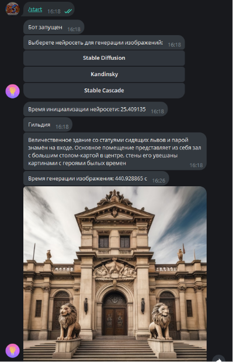
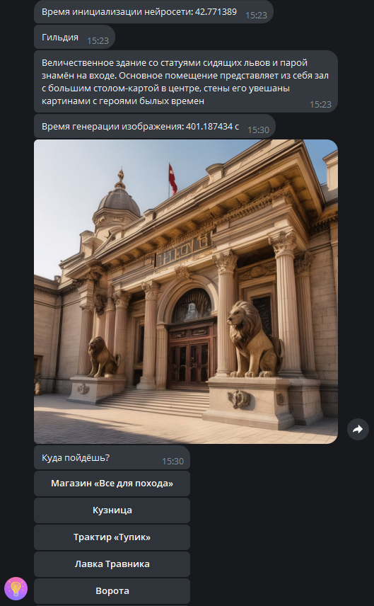
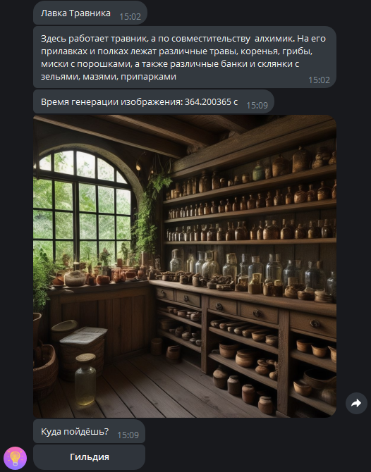

Телеграм бот, который позволяет перемещаться по предварительно 
описанным локациям, связанными между собой. При перемещении на 
локацию генерируется изображение, соответсвующее описанию локации. 
Картинки создаются одной из трёх нейросетей на выбор: Stable Diffusion, 
Kandinsky или Stable Cascade.

При загрузке нейросети в память записывается и выводится время загрузки 
для статистики, а также время генерации изображений. Для вывода 
статистики есть закреплённая внизу.

Для запуска бота требуется клонировать репозитории нейросетей в папку 
neuro_models.
https://huggingface.co/stabilityai/stable-cascade/tree/main
https://huggingface.co/kandinsky-community/kandinsky-2-1
https://huggingface.co/stabilityai/stable-diffusion-xl-base-1.0
Для этого нужно зарегистрироваться на сайте huggingface.co и зайти в 
свою учётную запись в консоли python с помощью команды: 
huggingface-cli login

А также требуется создать файл config.py и указать токены Телеграм API 
и Haggingface:
TG_API_TOKEN = ''
HAGGINGFACE_TOKEN = ''

Пример работы:
1. Выбор нейросети

2. Пример локации 1

3. Пример локации 2

